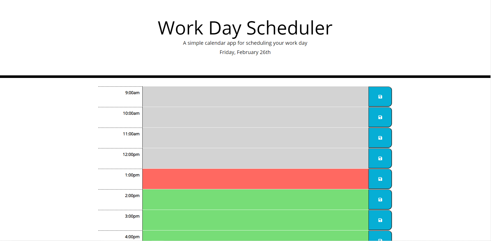
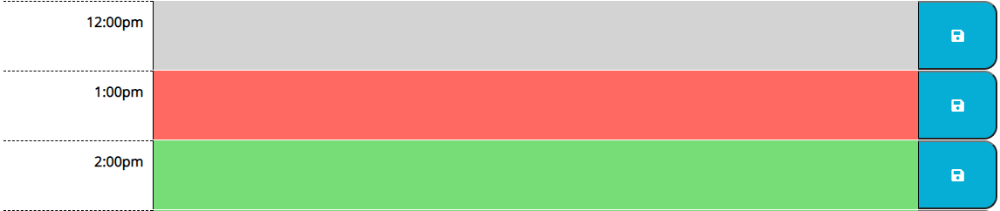

# Interactive Work-Day Events Planner

<a href="https://mephestomd.github.io/day-scheduler/">Day Scheduler</a>

*A Work-Day planner with interactive text cells and a save feature*

## Goal

To create an interactive work-day (9a-5p) planner with individual cells representing each hour of the work day. Users can input events to each hour-block by typing in the appropriate cell, and their events can be saved by clicking each cell's save icon.

## Purpose

To give the user a simple, easy-to-use and readily-accessible planner to keep track of events on a daily basis. Many of the more popular calendar apps are overly-complicated and bogged down with extraneous features. This planner represents a minimalistic approach that is designed make on-the-fly planning easy and fun!

## Method

JQuery DOM manipulation was used in conjunction with a **for** loop to generate a series of rows representing each hour of the day. Method() was used to call the current time in order to determine which cells needed to be rendered in gray (in the past), red (in the present), or green (in the future). JSON parse() and JSON stringify() methods were used to store user inputted data into the relevant **< textarea >** fields to the localStorage. Functions were created to recall this data upon refreshing of the page.

## Usage

The following will give examples and screenshots of how a user can interact with the planner:

Upon loading the page, the user will be presented with the following planner containing a header with the current date and a series of rows representing available time slots:

The following image shows how the hour(s) prior to the present will display with a gray background, the current hour with a red background, and the future hour(s) with a green background:

After entering event text, the user can click the save button (shown in the red box) to save the event data to local storage so that it remains on the page upon refresh:

## Credits

<ul>
<li>
Valerie Flores - Mentor and tutor || <a href="https://github.com/valeriemiller5">Github</a>
</li>

<li>
Guillermo Barila - TA || <a href="https://github.com/gui365">Github</a>
</li>

<li>
Samuel Maddox - TA || <a href="https://github.com/SamuelMaddox">Github</a>
</li>

<li>
w3schools.com jQuery Tutorial || <a href="https://www.w3schools.com/jquery/default.asp">w3schools - jQuery Tutorial</a>
</li>   
</ul>

## License

MIT License

Copyright (c) 2021 Maxson Green

Permission is hereby granted, free of charge, to any person obtaining a copy
of this software and associated documentation files (the "Software"), to deal
in the Software without restriction, including without limitation the rights
to use, copy, modify, merge, publish, distribute, sublicense, and/or sell
copies of the Software, and to permit persons to whom the Software is
furnished to do so, subject to the following conditions:

The above copyright notice and this permission notice shall be included in all
copies or substantial portions of the Software.

THE SOFTWARE IS PROVIDED "AS IS", WITHOUT WARRANTY OF ANY KIND, EXPRESS OR
IMPLIED, INCLUDING BUT NOT LIMITED TO THE WARRANTIES OF MERCHANTABILITY,
FITNESS FOR A PARTICULAR PURPOSE AND NONINFRINGEMENT. IN NO EVENT SHALL THE
AUTHORS OR COPYRIGHT HOLDERS BE LIABLE FOR ANY CLAIM, DAMAGES OR OTHER
LIABILITY, WHETHER IN AN ACTION OF CONTRACT, TORT OR OTHERWISE, ARISING FROM,
OUT OF OR IN CONNECTION WITH THE SOFTWARE OR THE USE OR OTHER DEALINGS IN THE
SOFTWARE.